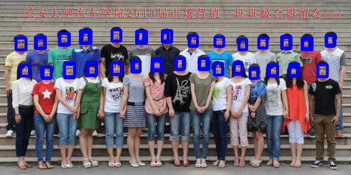
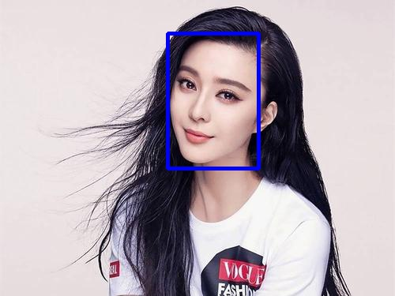
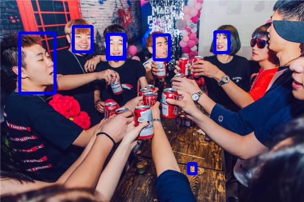

# MTCNN-tensorflow

复现[Joint Face Detection and Alignment Using Multitask Cascaded Convolutional Networks](https://ieeexplore.ieee.org/stamp/stamp.jsp?tp=&arnumber=7553523)论文，参考了众多复现代码，在此附上链接并对表示感谢~

* https://github.com/kpzhang93/MTCNN_face_detection_alignment
* https://github.com/CongWeilin/mtcnn-caffe
* [https://github.com/Seanlinx/mtcnn
* https://github.com/AITTSMD/MTCNN-Tensorflow

## 环境依赖

* Window10+GTX 1060+Python3.6+Anaconda5.2.0+Spyder+Tensorflow1.9-gpu

## 结果

## 总结

* 自己参考复现的MTCNN代码效果个人感觉一般，结果未加入landmark，实测landmark结果并不好。
* 在生成Onet数据集时，Pnet+Rnet生成的负样本数太少，导致我需要使用WIDER_train数据集重新生成一些样本来保证样本数，这导致Onet的效果较原文逊色了不少，Onet训练差也导致输出landmark不准确。
* 本人使用的是联想拯救者R720笔记本，搭配GTX 1060 。测试阶段一张图片消耗时间主要取决于Pnet，Rnet与Onet平均0.5s即可计算完毕。
* 召回率主要取决于threshold的取值，由于需要很高的召回率所以threshold取值很低，导致了部分图片还是有误检，误检部分原因还是因为Onet数据集少的问题，参考代码中仅有一人试图增强样本数，其他的复现均未提及做法，本人尚未尝试仅使用少量数据训练Onet的结果。

## 其他

我的[CSDN博客](https://blog.csdn.net/Rrui7739/article/details/82084022)上有详细的说明，欢迎大家指教~